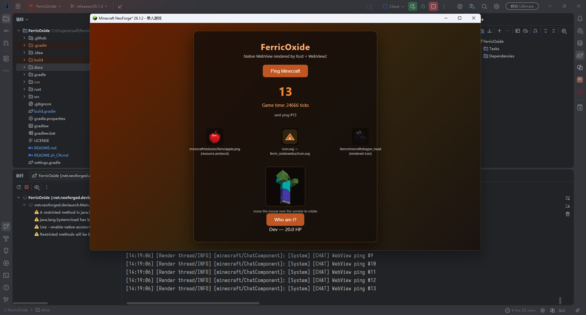

<div align="center">


# FerricOxide

**Native WebView UI for Minecraft, driven by Rust.**

English | [简体中文](README.zh_CN.md)

</div>

FerricOxide renders modern web UI (HTML/CSS/JS) inside Minecraft by calling the operating
system's native WebView through a thin Rust JNI bridge — no bundled browser engines, no
embedded Chromium. It is a lightweight, high-performance, cross-platform GUI foundation for
Minecraft mod developers.

## Preview



## How it works

```
┌─────────────────────────── Minecraft (Java) ───────────────────────────┐
│  WebUi (public API) ──► NativeWebView (JNI stubs)                     │
└───────────────────────────────────┬────────────────────────────────────┘
                                    │ JNI calls (fire-and-forget commands)
┌─────────────────────────── Rust (cdylib) ─────────────────────────────┐
│  ferric_oxide_native: jni + wry + tao                                  │
│  dedicated event-loop thread owns every WebView/window                 │
└───────────────────────────────────┬────────────────────────────────────┘
                                    │ OS native WebView
        Windows: WebView2 (Chromium) │ macOS: WKWebView    Linux: WebKitGTK
```

- **Java** exposes a small, mod-developer-friendly API (`WebUi`), backed by thin JNI stubs
  (`NativeWebView`).
- **Rust** (`rust/`, crate `ferric_oxide_native`) uses [`wry`](https://crates.io/crates/wry)
  to drive the platform's native WebView. All window/WebView work happens on one dedicated
  event-loop thread; JNI calls become messages sent through an `EventLoopProxy`, so no game
  thread is ever blocked.
- **Embedding**: on Windows the WebView is created as an HWND child of the Minecraft window
  (`WebViewBuilder::build_as_child`), so the web UI is pinned to the game window and follows
  its size. Other platforms currently fall back to a standalone window.
- **Two-way bridge**: events and queries flow in both directions over one JSON protocol.
  Java uses `WebUi.bridge()`, the page uses `ferric.emit / on / call / handle` — the runtime
  is injected before any page script, so no feature detection is needed. See
  [`docs/webui-bridge.md`](docs/webui-bridge.md).

## Requirements

- Minecraft / NeoForge dev environment (see `gradle.properties` for the pinned versions)
- JDK 25
- Rust toolchain (`cargo`, stable) — needed to build the native library locally
- Node.js 22+ — runs the page-side bridge tests during `./gradlew check`
- Windows: WebView2 Runtime (preinstalled on Windows 11 / modern Edge)
- Linux: WebKitGTK 4.1 and D-Bus runtime libraries (for example,
  `libwebkit2gtk-4.1-0` and `libdbus-1-3` on Ubuntu)

## Building

```bash
./gradlew build
```

A normal local build invokes `cargo build --release` via the `buildRustNative` task, copies the
host library into the jar at `natives/<platform>/<arch>/...`, and configures dev runs with the
`ferricoxide.native.path` system property. The `NativeLoader` first honours that property and
otherwise extracts the matching library from the mod jar at runtime.

The reusable GitHub Actions build compiles these eight native targets in parallel and packages
them into one mod JAR:

| Platform        | Rust target                 | JAR resource                                         |
|-----------------|-----------------------------|------------------------------------------------------|
| Windows x86     | `i686-pc-windows-msvc`      | `natives/windows/x86/ferric_oxide_native.dll`        |
| Windows x86_64  | `x86_64-pc-windows-msvc`    | `natives/windows/x86_64/ferric_oxide_native.dll`     |
| Windows aarch64 | `aarch64-pc-windows-msvc`   | `natives/windows/aarch64/ferric_oxide_native.dll`    |
| Linux x86       | `i686-unknown-linux-gnu`    | `natives/linux/x86/libferric_oxide_native.so`        |
| Linux x86_64    | `x86_64-unknown-linux-gnu`  | `natives/linux/x86_64/libferric_oxide_native.so`     |
| Linux aarch64   | `aarch64-unknown-linux-gnu` | `natives/linux/aarch64/libferric_oxide_native.so`    |
| macOS x86_64    | `x86_64-apple-darwin`       | `natives/macos/x86_64/libferric_oxide_native.dylib`  |
| macOS aarch64   | `aarch64-apple-darwin`      | `natives/macos/aarch64/libferric_oxide_native.dylib` |

The packaging job supplies the merged resource directory with
`-PprebuiltNativesDir=/path/to/natives`. In this mode Gradle copies every prebuilt native and
does not run Cargo; without the property, local and development-run behavior remains unchanged.

## CI versions and publishing

The baseline version is `mod_version` in `gradle.properties`. CI passes an override to Gradle, so
the JAR filename and the embedded NeoForge metadata always carry the same version:

- A push that changes build inputs on `releases/**` publishes an **alpha** to Modrinth and
  CurseForge as `<mod_version>+build.<GitHub run number>`, for example `0.0.1+build.123`.
- Pushing a `v<mod_version>` tag, for example `v0.0.1`, validates that it exactly matches
  `gradle.properties`, then publishes a stable release to Modrinth, CurseForge, and GitHub.
- Pull requests only run the eight-target build and test checks; they cannot publish.

Repository secrets required for publishing are `MODRINTH_TOKEN` and `CURSEFORGE_TOKEN`. The
workflow fails visibly if either platform rejects an upload; it never silently skips a release.

The x86 libraries are built and packaged for completeness, but current Minecraft, JDK 25, and
LWJGL distributions generally do not provide a complete 32-bit runtime. Loading an x86 native
still requires an x86 JVM and an otherwise architecture-compatible game environment. Packaging
the Linux libraries also does not bundle their WebKitGTK, GTK, or D-Bus system dependencies.

## Using the API

Java side — payloads are plain records, converted with Gson:

```java
import dev.anvilcraft.oxide.ferric.webui.WebUi;

record Clicked(int value) {}
record Data(int foo) {}
record PlayerInfo(String name, float health) {}

// Load your page from the mod's assets, embed it into the Minecraft window:
WebUi ui = WebUi.embedded(
    "My Mod UI", "my_mod", "webui/index.html",
    minecraft.getWindow().getWidth(),
    minecraft.getWindow().getHeight()
);

ui.bridge()
    // JS -> Java event (handlers always run on the render thread):
    .on("my_mod.clicked", Clicked.class, clicked -> doSomething(clicked.value()))
    // JS -> Java query — whatever you return is sent back to the page:
    .handle("my_mod.player", Void.class, ignored -> new PlayerInfo("Steve", 20.0F));

// Java -> JS event:
ui.bridge().emit("my_mod.data", new Data(42));

// Java -> JS query:
ui.bridge().call("my_mod.form", null, FormValues.class).thenAccept(this::save);

// WebUi is AutoCloseable; close() destroys the native window (also reclaimed by GC).
ui.close();
```

Page side — the mirror image, no setup required:

```js
ferric.emit('my_mod.clicked', {value: 42});
const player = await ferric.call('my_mod.player');

ferric.on('my_mod.data', (data) => render(data.foo));
ferric.handle('my_mod.form', () => collectFormValues());

// Game resources, without worrying about the platform's URL scheme:
img.src = ferric.resource('item/minecraft:apple', {size: 48});
```

Open a standalone (non-embedded) window with `WebUi.window(...)` instead. The raw lower-level
API (`NativeWebView.Builder`, `MessageHandler`, `CreationCallback`) is available under
`dev.anvilcraft.oxide.ferric.webui` for advanced use.

## Demo

Run `/ferric ui demo` in-game to open the bundled demo UI. It exercises every direction of the
bridge: it pings the game chat (JS event), queries the player's name and health with
**Who am I?** (JS query), receives the world time once per second and rendered entity frames
(Java events). Press **Esc** in the WebView to close it and return mouse control to Minecraft.

Set `FERRICOXIDE_AUTO_OPEN=1` to open the demo UI automatically after launch (used for
smoke-testing).

## Project layout

```
rust/                          Native JNI bridge (wry + tao + jni)
  src/lib.rs                   JNI entry points, event-loop thread, embedded/standalone WebViews
src/main/java/dev/anvilcraft/oxide/ferric/
  FerricOxide.java            Mod entry point
  client/FerricOxideClient.java  Client command + demo UI wiring
  webui/WebUi.java            Public high-level API
  webui/NativeWebView.java    Low-level JNI wrapper
  webui/NativeLoader.java     Library loading (system property / jar extraction)
  webui/bridge/               Two-way event/query bridge (WebBridge + protocol)
src/main/resources/assets/ferric_oxide/webui/
  bridge.js                    Page-side bridge runtime (injected before page scripts)
  demo.html                    Demo page
src/test/java/                 JUnit tests for the Java bridge half
src/test/js/bridge.test.js     Node tests for the page-side bridge half
docs/webui-bridge.md           Bridge protocol and API design
```

## License

GNU LGPL 3.0
